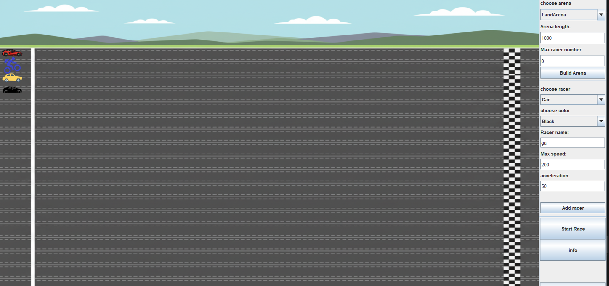

<div align="center">
<h1>MULTITHREADED RACING SIMULATION FRAMEWORK</h1>

A comprehensive Java-based racing simulation demonstrating advanced design patterns and object-oriented programming principles
</div>

<div align="center">

**Authors:** Gai Shukrun 

[]()
[]()

</div>

## Built with the tools and technologies:

<div align="center">

[]()
[]()
[]()
[]()

[]()
[]()
[]()
[]()

[]()
[]()
[]()

</div>

## Project Overview

This project is a multithreaded racing simulation built in Java. It uses a Swing GUI to visualize a race where multiple racers compete in different types of arenas. The core of the project demonstrates the practical application of several key software engineering concepts.

### Core Concepts Implemented

Here is a breakdown of the specific programming concepts and design patterns used in this project:

#### 1. State Design Pattern

This pattern is used to manage the changing condition of a `Racer` during the race.

-   **`RacerState` Interface**: Defines the common contract for all states.
-   **Concrete States**: You have implemented four states:
    -   `ActiveState`: For a racer that is currently racing.
    -   `BrokenState`: For a racer that has a temporary mishap.
    -   `FailedState`: For a racer that can no longer continue the race.
    -   `FinishedState`: For a racer that has crossed the finish line.
-   **Context**: The `Racer` class holds a `RacerState` object. The state is changed dynamically within the `RaceRunnable` based on events like mishaps or finishing the race.

#### 2. Concurrency and Multithreading

This is used to make all racers move simultaneously and independently.

-   **`Runnable` and `Thread`**: The `RaceRunnable` class implements `Runnable`, and each racer is executed on its own `Thread`.
-   **Concurrency Control**: You used `java.util.concurrent.locks.ReentrantLock` to prevent race conditions.
    -   Three separate locks (`l1`, `l2`, `l3`) are used in `RaceRunnable` to protect shared resources during critical operations like calculating finishing place, updating racer state, and calculating movement.

#### 3. Factory Design Pattern (with Reflection)

This pattern is used to create `Arena` and `Racer` objects without hardcoding their class names.

-   **`RaceBuilder` Singleton**: This class acts as the central factory.
-   **Java Reflection**: The factory uses `ClassLoader.getSystemClassLoader().loadClass()` and `constructor.newInstance()` to create objects from class name strings passed from the GUI. This makes the system extensible, as new racer or arena types can be added without changing the factory's core logic.

#### 4. Observer Design Pattern

This pattern is used to update the GUI with live race data without creating a direct dependency between the game logic and the UI.

-   **`MyObserver` and `MyObservable`**: You created custom observer/observable interfaces.
-   **Implementation**: The `Arena` is the observable object that maintains a list of observers. The `MainScreen` is the observer. When a racer's data changes in its thread, it calls `arena.notifyObservers()`, which pushes the new data to the GUI to be displayed in the information table.

#### 5. Prototype Design Pattern

This pattern is used to create new `Racer` objects by copying an existing one.

-   **`Cloneable` Interface**: The abstract `Racer` class implements `Cloneable`.
-   **Implementation**: The `MainScreen` provides a feature to "Add From Existing Racer". This works by calling the `clone()` method on a selected racer prototype, creating a new object with the same attributes, which can then be customized (e.g., color) and added to the race.

#### 6. Object-Oriented Programming (OOP)

The project is built on a solid foundation of OOP principles.

-   **Inheritance**: You have created deep inheritance hierarchies for both arenas and racers (e.g., `Racer` -> `LandRacer` -> `Car`).
-   **Polymorphism**: The main simulation loop operates on abstract `Racer` and `Arena` objects, but the specific behavior (like movement or legal racer checks) is determined by the concrete subclasses at runtime.
-   **Abstraction**: `Arena` and `Racer` are abstract classes, defining common behaviors and attributes for all types of arenas and racers.
-   **Encapsulation**: All class properties are private, with access controlled through public getter and setter methods.


## Application Screenshots



## Core Features

### 🏁 Multi-Arena Racing System
- **Three Arena Types**: Aerial, Land, and Naval environments with unique characteristics
- **Dynamic Arena Creation**: Factory pattern implementation for flexible arena instantiation
- **Environment-Specific Rules**: Each arena type enforces racer compatibility and environmental effects
- **Scalable Architecture**: Easy addition of new arena types through inheritance

### 🏎️ Diverse Racer Types
- **Air Racers**: Airplanes with landing gear, Helicopters with hovering capabilities
- **Land Racers**: Cars with engine types, Bicycles with gear systems, Horses with breed characteristics
- **Naval Racers**: SpeedBoats with engine power, RowBoats with team configurations
- **Wheeled Interface**: Special handling for vehicles with wheel-based mechanics

### 🔄 Advanced State Management
- **State Pattern Implementation**: Clean state transitions for racer conditions
- **Four Racer States**: Active (racing), Broken (temporary failure), Failed (permanent), Finished (completed)
- **Dynamic State Changes**: Real-time state updates based on race events and mishaps
- **State Persistence**: Maintains racer condition throughout race duration

### 🏭 Dynamic Object Creation
- **Factory Pattern**: Singleton RaceBuilder for runtime object instantiation
- **Reflection-Based Creation**: Dynamic class loading and constructor invocation
- **Type Safety**: Comprehensive exception handling for invalid configurations
- **Extensibility**: Easy addition of new racer and arena types without code modification

### 🎮 Interactive GUI Interface
- **Swing-Based UI**: Professional desktop application with multiple panels
- **Real-Time Visualization**: Live race progress with racer positioning and status updates
- **Configuration Panels**: Interactive setup for arenas, racers, and race parameters
- **Observer Pattern**: Decoupled GUI updates through event notification system

### 🎲 Sophisticated Race Mechanics
- **Mishap System**: Random events affecting racer performance with probability calculations
- **Physics Simulation**: Speed, acceleration, and friction calculations for realistic movement
- **Turn-Based Progression**: Structured race advancement with comprehensive logging
- **Results Management**: Detailed race statistics and final rankings

## Quick Start

The easiest way to run the application:

### Console Version
```bash
javac utilities/Program.java
java utilities.Program
```

### GUI Version
```bash
javac GUI/MainScreen.java
java GUI.MainScreen
```

## Manual Setup

### Prerequisites

- **Java Development Kit (JDK)** 8 or higher
- **Java Runtime Environment (JRE)** for execution
- **IDE** (recommended: IntelliJ IDEA, Eclipse, or VS Code with Java extensions)

### Installation

1. Clone the repository:

   ```bash
   git clone https://github.com/GaiShukrun/Multithreaded-Simulation-Framework.git
   cd Multithreaded-Simulation-Framework
   ```

2. Compile all Java files:

   ```bash
   javac -cp . utilities/*.java factory/*.java States/*.java game/**/*.java GUI/*.java
   ```

3. Run the console application:

   ```bash
   java utilities.Program
   ```

4. Or run the GUI application:

   ```bash
   java GUI.MainScreen
   ```

### Build for Distribution

Create a JAR file for easy distribution:

```bash
jar cvfm RacingSimulation.jar META-INF/MANIFEST.MF *.class **/*.class
java -jar RacingSimulation.jar
```

## Tech Stack

- **Core Language**: Java 8+ with advanced OOP concepts
- **GUI Framework**: Java Swing for desktop application interface
- **Design Patterns**: Factory, State, Observer, and Singleton implementations
- **Concurrency**: Multithreading for race simulation and GUI responsiveness
- **Reflection**: Dynamic class loading and object instantiation
- **Exception Handling**: Custom exceptions for race-specific error management

## Key Components

### Factory Pattern Implementation
- **RaceBuilder**: Singleton factory managing dynamic object creation using reflection
- **Flexible Instantiation**: Support for both standard and wheeled racer construction
- **Type Safety**: Comprehensive exception handling for invalid class loading and instantiation

### State Pattern Architecture
- **RacerState Interface**: Contract defining state behavior for all racer conditions
- **Concrete States**: ActiveState, BrokenState, FailedState, and FinishedState implementations
- **State Transitions**: Clean, predictable state changes based on race events

### Observer Pattern Integration
- **GUI Updates**: Real-time interface updates through observer notifications
- **Decoupled Architecture**: Separation of game logic from presentation layer
- **Event-Driven Design**: Responsive user interface with automatic updates

### Arena System
- **Abstract Arena**: Base class defining common racing environment behavior
- **Specialized Arenas**: AerialArena, LandArena, and NavalArena with unique characteristics
- **Racer Validation**: Type checking to ensure compatible racer-arena combinations

### Racer Hierarchy
- **Abstract Racer**: Base class with common racing behavior and state management
- **Specialized Racers**: Type-specific implementations with unique characteristics and capabilities
- **Wheeled Interface**: Additional behavior for vehicles with wheel-based mechanics

## Development Features

### Object-Oriented Design
- **Inheritance Hierarchies**: Well-structured class relationships with proper abstraction
- **Polymorphism**: Runtime behavior determination through method overriding
- **Encapsulation**: Proper data hiding and controlled access through getters/setters

### Design Pattern Implementation
- **Educational Value**: Clear examples of Gang of Four design patterns in practical use
- **Best Practices**: Industry-standard implementation approaches and coding conventions
- **Extensibility**: Architecture designed for easy addition of new features and components

### Exception Handling
- **Custom Exceptions**: RacerLimitException and RacerTypeException for domain-specific errors
- **Graceful Degradation**: Fallback mechanisms when reflection operations fail
- **Comprehensive Logging**: Detailed error reporting and race event tracking

## Educational Value

This project serves as a comprehensive example of:
- **Advanced Java Programming**: Reflection, multithreading, and GUI development
- **Design Pattern Implementation**: Practical application of multiple design patterns
- **Object-Oriented Principles**: Inheritance, polymorphism, encapsulation, and abstraction
- **Software Architecture**: Clean code organization and separation of concerns
- **Exception Handling**: Robust error management and recovery strategies

## Contributing

Please read our contributing guidelines before submitting pull requests to the project.

## License

This project was developed as part of an Object-Oriented Programming course, demonstrating advanced Java concepts and design patterns.
